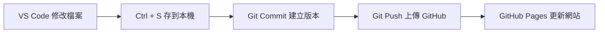

# Git 入門(一)：Git、GitHub、VS Code 到底是什麼？

> 建立日期：2026-06-30
>
> 系列：Git 基礎 (Git Basics)
>
> 適合對象：
>
> - 第一次接觸 Git 的學習者
> - 正在建立個人網站的人
> - 曾經搞混 Git、GitHub、GitHub Pages 的人

---

# 本篇閱讀重點

閱讀完成後，你將能理解：

- Git 與 GitHub 的差異
- Git 在網站開發流程中的角色
- GitHub Pages 的用途
- Repository（儲存庫）的概念
- 網站從建立到發布的完整流程

> ⚠️ 本篇重點在建立觀念，不包含 Git 指令（Command）、Branch（分支）、Merge（合併）等進階操作。

---

# 一、先理解四個角色

很多初學者容易把 Git、GitHub、VS Code 混在一起，其實它們各自負責不同的工作。

| 工具 | 中文名稱 | 主要角色 | 功能 |
|------|---------|---------|------|
| VS Code | 程式碼編輯器(Code Editor) | 編輯 | 撰寫網站、Python、Markdown 等 |
| Git | 版本控制系統(Version Control System, VCS) | 記錄 | 建立每一次修改的版本歷史 |
| GitHub | 程式碼託管平台(Code Hosting Platform) | 保存 | 儲存 Git 專案、分享、協作、備份 |
| GitHub Pages | 靜態網站服務(Static Website Hosting) | 發布 | 將網站公開到網際網路 |

---

# 二、四者之間的關係

```text
VS Code
    │
    │ 編輯內容
    ▼
Git
    │ 建立版本（Commit）
    ▼
GitHub
    │ 上傳同步（Push）
    ▼
GitHub Pages
    │
    ▼
公開網站
```

一句話整理：

- VS Code 負責「寫」
- Git 負責「記」
- GitHub 負責「收」
- GitHub Pages 負責「展示」

---

# 三、Git 與 GitHub 的差別

很多人以為：

> Git 是 GitHub 的一部分。

其實不是。

真正的關係應該是：

```text
Git
   │
   ▼
GitHub
```

Git 是一套安裝在自己電腦上的版本控制工具。

GitHub 則是提供 Git 專案保存與分享的雲端平台。

可以把它想成：

```text
Excel
   │
   ▼
OneDrive
```

Excel 負責製作文件。

OneDrive 負責保存文件。

Git 與 GitHub 的關係也是如此。

---

# 四、VS Code 會自動存到 GitHub 嗎？

答案：

**不會。**

按下：

```text
Ctrl + S
```

只是把檔案存到：

> 本機電腦。

此時：

| 地點 | 是否更新 |
|------|---------|
| 本機檔案 | ✅ |
| Git | ❌ |
| GitHub | ❌ |
| GitHub Pages | ❌ |

---

# 五、Git 什麼時候開始工作？

Git 不會一直監視你的檔案。

只有當你告訴它：

> 「這次修改完成，請建立一個正式版本。」

Git 才會建立：

> **Commit（提交版本）**

之後再透過：

> **Push（推送）**

將版本同步到 GitHub。

---

# 六、完整網站發布流程



---

# 七、沒有網路可以工作嗎？

答案：

**可以。**

| 工作 | 是否需要網路 |
|------|-------------|
| 開啟 VS Code | ❌ |
| 修改 Markdown | ❌ |
| Ctrl + S | ❌ |
| Git Commit | ❌ |
| Git Push | ✅ |
| Git Pull | ✅ |

Git 是本機工具。

GitHub 才是網路服務。

---

# 八、多台電腦如何同步？

例如：

```text
教室電腦

    │

 Commit

    │

 Push

    ▼

 GitHub

    ▲

 Pull

    │

家裡電腦
```

因此：

不用 USB。

不用 Email。

不用 Line 傳檔。

只需要：

> Commit → Push → Pull

即可同步所有電腦。

---

# 九、Git 不只是備份工具

Git 真正保存的是：

> 每一個時間點的完整版本。

例如：

```text
BI Version 1.0

↓

BI Version 2.0

↓

BI Version 3.0
```

每一次 Commit 都是一個新的歷史版本。

即使回到：

```text
BI Version 1.0
```

觀看內容，

也不會影響：

- BI Version 2.0
- BI Version 3.0

因此：

Git 更像是一台：

> **專案時間機（Time Machine）。**

---

# 十、Git 與區塊鏈的共同點

Git 與區塊鏈（Blockchain）並不是同一種技術。

但是底層概念有許多相似之處。

| 比較項目 | Git | 區塊鏈 |
|-----------|-----|-------|
| 使用 Hash | ✅ | ✅ |
| 保存歷史 | ✅ | ✅ |
| 每筆資料都有唯一識別碼 | ✅ | ✅ |
| 可驗證是否遭修改 | ✅ | ✅ |
| 去中心化 | ❌ | ✅ |
| 共識機制 | ❌ | ✅ |

共同理念：

> 利用 Hash 建立可追蹤、可驗證的歷史紀錄。

---

# 十一、本次最佳理解模型

## 📖 寫書模型

```text
VS Code
=
書房
（每天寫手稿）

↓

Git Commit
=
出版社
（整理成正式版本）

↓

GitHub
=
國家圖書館
（保存每一版）

↓

GitHub Pages
=
書店展示櫥窗
（公開給大家閱讀）
```

因此，每天真正的工作流程就是：

```text
寫手稿

↓

Ctrl + S

↓

Commit

↓

Push

↓

網站更新
```

---

# 十二、本篇重點整理

今天建立了四個工具的角色定位：

- VS Code：負責編輯。
- Git：負責管理版本。
- GitHub：負責保存專案。
- GitHub Pages：負責公開網站。

因此：

> **Git 的本質不是備份工具，而是一套管理專案歷史的時間機器。**

---

# 下一篇預告

Git 基礎系列將持續介紹：

- Git-02：Repository（儲存庫）是什麼？
- Git-03：Commit（提交版本）到底做了什麼？
- Git-04：Push 與 Pull 的真正用途。
- Git-05：Branch（分支）是什麼？
- Git-06：Merge（合併）如何運作？
- Git-07：GitHub Pages 建立網站。
- Git-08：VS Code + GitHub 建立個人品牌網站實戰。